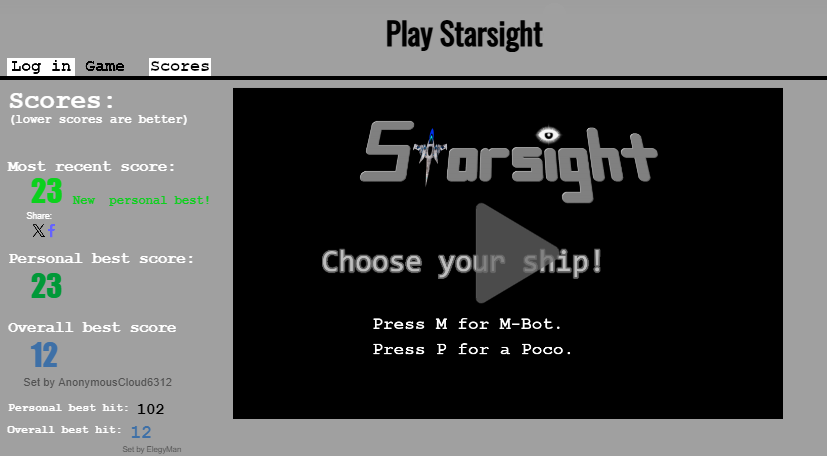
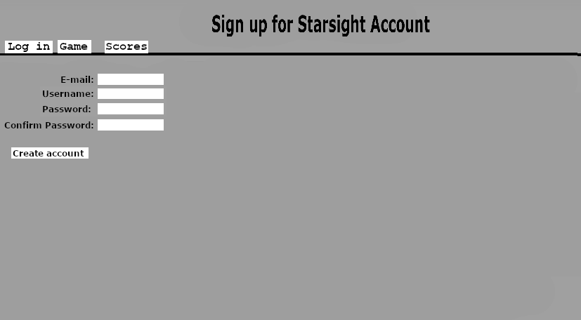
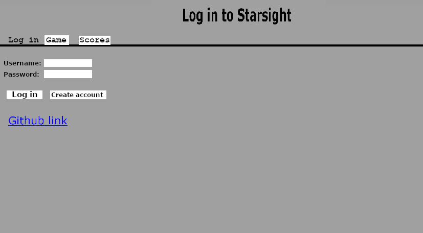
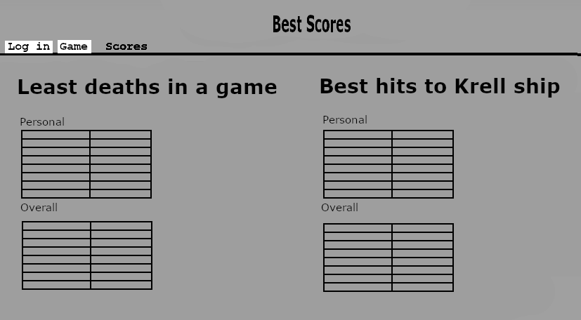

# Starsight

[My Notes](notes.md)

## 🚀 Specification Deliverable

For this deliverable I did the following. I checked the box `[x]` and added a description for things I completed.

- [x] Proper use of Markdown
- [x] A concise and compelling elevator pitch
- [x] Description of key features
- [x] Description of how you will use each technology
- [x] One or more rough sketches of your application. Images must be embedded in this file using Markdown image references.

### Elevator pitch

For anyone who's read and enjoyed the [Skyward series](https://www.brandonsanderson.com/pages/skyward-series), or just likes simple 2D space action games à la [Asteroids](https://en.wikipedia.org/wiki/Asteroids_(video_game)), this is for you! Take down evil Commander Winzik's ship by using your light-lance to grapple rocks thrown by the [Delver](https://coppermind.net/wiki/Delver) and sling them at the battleship. The plan is to make a website will all the basic functionality necessary to one day implement the full game online (originally written by me as an offline game in Python).

### Design

   

### Key features

- Account creation page
- Login page
- Starsigt game UI
- Scores sidebar:
    - Most recent score
    - Personal best score
    - Overall best score (updates using websocket)
    - Personal best hit to enemy spaceship
    - Overall best hit to enemy spaceship
- Page for top 10 of each kind of score (Personal best, Overall best, Personal best hit, Overall best hit)

### Technologies

I am going to use the required technologies in the following ways.

- **HTML** - Set up webpage with main game screen, title, and scores to the left of the game screen, as well as scores page with table of top 10 personal and overall bests, and login page
- **CSS** - Stylize text, display little animation on game page whenever the most recent score, personal best, or overall best score updates, make scores page look cool and not boring, format XKCD comic on login page
- **React** - Handle transitions between homepage, game UI, and account creation screen. Also handle registering of interactions with game, and animation
- **Service** - To log in, log out, create account, update scores, fetch updated scores, and fetch a random XKCD comic on the login page
- **DB/Login** - Store authentication tokens, accounts, most recent scores, and high scores
- **WebSocket** - Probably not going to finish this part, honestly.

## 🚀 AWS deliverable

For this deliverable I did the following. I checked the box `[x]` and added a description for things I completed.

- [x] **Server deployed and accessible with custom domain name** - [My server link](https://starsight.click).

## 🚀 HTML deliverable

For this deliverable I did the following. I checked the box `[x]` and added a description for things I completed.

- [x] **HTML pages** - Scores page, game page, login page, and account creation page.
- [x] **Proper HTML element usage** - Body, div, headers, sections, footer, etc.
- [x] **Links** - To Facebook, this repo, navigation between pages
- [x] **Text** - Scores on scores page and game page
- [x] **3rd party API placeholder** - Buttons to share score on Facebook, Twitter
- [x] **Images** - Logos for FB, Twitter, that link to their respective home pages, Github logo linking to this repo, placeholder for game window
- [x] **Login placeholder** - I did not complete this part of the deliverable.
- [x] **DB data placeholder** - High scores on scores page
- [x] **WebSocket placeholder** - Image for game window

## 🚀 CSS deliverable

For this deliverable I did the following. I checked the box `[x]` and added a description for things I completed.

- [x] **Header, footer, and main content body** - These are present in the website
- [x] **Navigation elements** - You can navigate between pages
- [x] **Responsive to window resizing** - Score summary only appears if there's room; game window is centered in remaining space
- [x] **Application elements** - Many types of elements
- [x] **Application text content** - Scores and such
- [x] **Application images** - Logos for FB, Twitter, that link to their respective home pages, Github logo linking to this repo, placeholder for game window

## 🚀 React part 1: Routing deliverable

For this deliverable I did the following. I checked the box `[x]` and added a description for things I completed.

- [x] **Bundled using Vite** - Bundled using Vite
- [x] **Components** - Same pages as before, with some visual tweaks and a lot of reformatting, added Not Found page
- [x] **Router** - I used a BrowserRouter to navigate between pages

## 🚀 React part 2: Reactivity deliverable

For this deliverable I did the following. I checked the box `[x]` and added a description for things I completed.

- [x] **All functionality implemented or mocked out** - Login and account creation is simulated within the browser. Game itself will depend on a websocket connection to the server to prevent cheating; client will send player input events to the server, which will process them and send back data indicating how to draw the next animation frame. (This website is just a web implementation of a Python game that I wrote years ago, so the processing/running of the game that the server will do is basically already written out in a Python script.) Anyway, I've got the browser to register all the input events that I'll need to play the game, and it responds to most of them (including mouse movement, clicks, scroll wheel movement, pressing slash or spacebar) but at this point the game is very boring. The "hit" aspect is represented by how many times you press the slash key in a game. The scores page accurately reflects whatever "scores" and "hits" were achieved by various players.
- [x] **Hooks** - I used useEffect, useState, and useRef in game.jsx.

## 🚀 Service deliverable

For this deliverable I did the following. I checked the box `[x]` and added a description for things I completed.

- [x] **Node.js/Express HTTP service** - Server uses Express to store and update login information and scores.
- [x] **Static middleware for frontend** - Used a middleware to verify identity of user when necessary, and another middleware to detect and reject any null values in score update requests.
- [x] **Calls to third party endpoints** - Server requests an XKCD comic and serves up the URL for the login page. For some reason I'm not allowed to request the URL from the frontend directly, so the server has to request the URL and forward it to the frontend, which renders the comic.
- [x] **Backend service endpoints** - 
1. Get top 10 scores in each category (personal and overall best score, personal and overall best hit, for score page)
2. Get single highest score in each category (for game page)
3. Create account
4. Log in
5. Log out
6. Check whether a given username or email is already registered (before creating account or logging in)
7. XKCD
8. Update scores or spaceship hits
- [x] **Frontend calls service endpoints** - Frontend calls each one of the endpoints
- [x] **Supports registration, login, logout, and restricted endpoint** - All of these are implemented; scores page and game page require you to have an account

## 🚀 DB deliverable

For this deliverable I did the following. I checked the box `[x]` and added a description for things I completed.

- [x] **Stores data in MongoDB** - All scores data is stored in MongoDB
- [x] **Stores credentials in MongoDB** - All authTokens and accounts stored in MongoDB

## 🚀 WebSocket deliverable

For this deliverable I did the following. I checked the box `[x]` and added a description for things I completed.

- [ ] **Backend listens for WebSocket connection** - I did not complete this part of the deliverable.
- [ ] **Frontend makes WebSocket connection** - I did not complete this part of the deliverable.
- [ ] **Data sent over WebSocket connection** - I did not complete this part of the deliverable.
- [ ] **WebSocket data displayed** - I did not complete this part of the deliverable.
- [ ] **Application is fully functional** - I did not complete this part of the deliverable.
